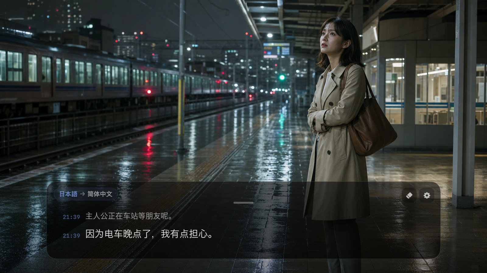
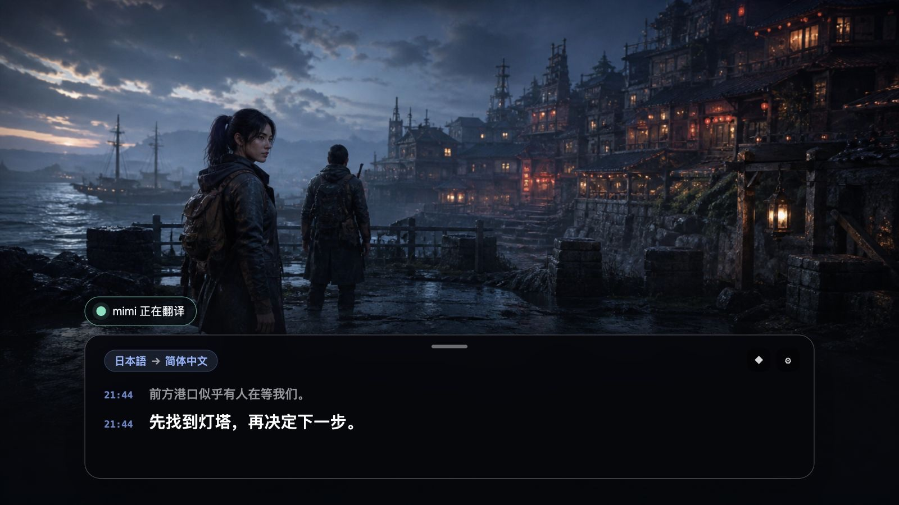
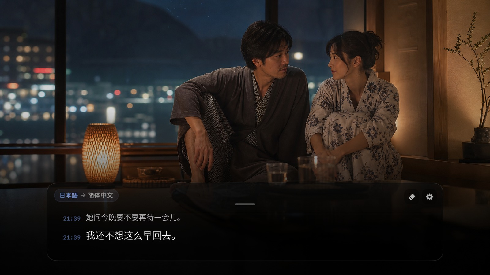
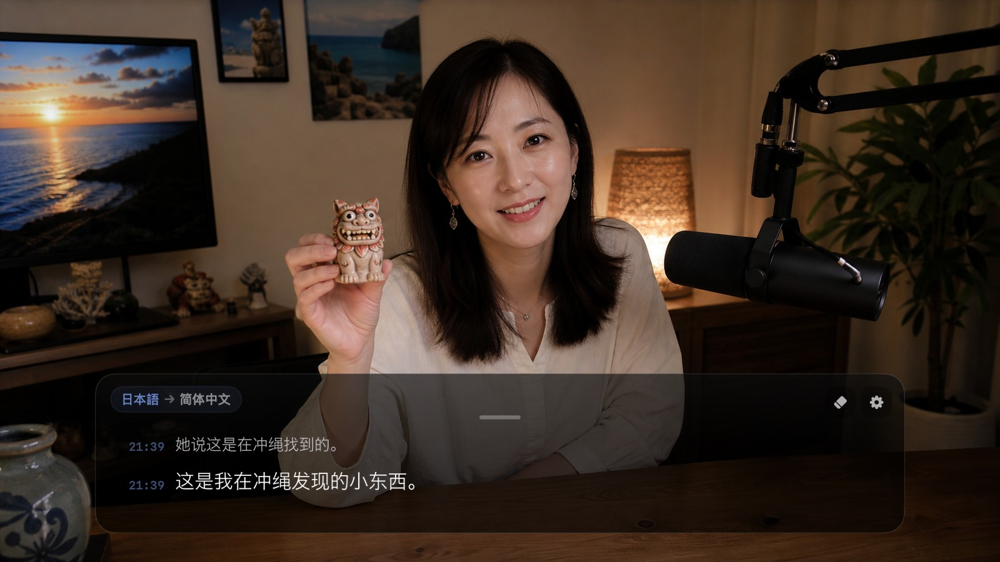
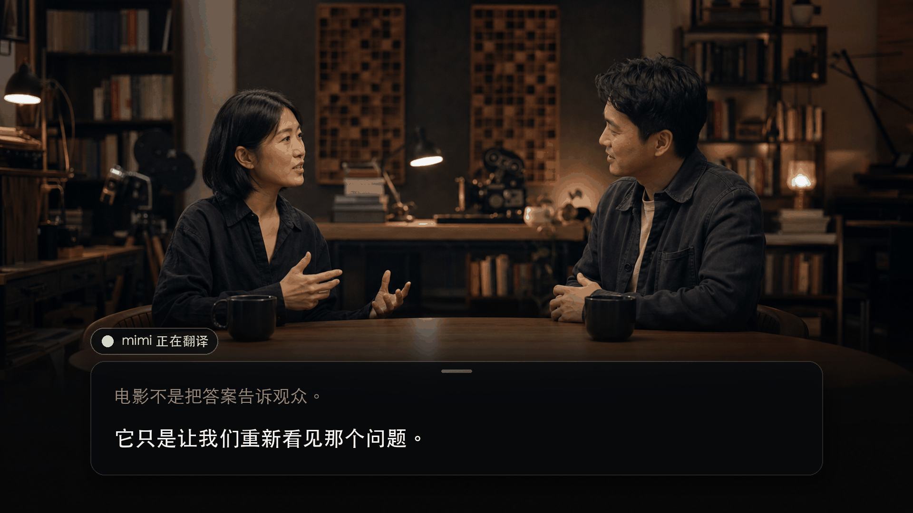

<div align="center">
  
  <h1>mimi</h1>
  <p>Mac 上的实时翻译字幕</p>
  <p>
    <a href="https://github.com/yuxino/mimi/releases/latest"><strong>下载 mimi</strong></a>
    · <a href="README_EN.md">English</a>
    · <a href="README_JA.md">日本語</a>
  </p>
</div>

mimi 这个名字来自日语「耳（みみ）」的读音，写成罗马字就是 mimi。

它听取 Mac 正在播放的声音，把中文、日语、英语或韩语实时变成原文字幕，或翻译成简体中文、英语或日语。浏览器、播放器、线上会议和桌面应用都可以使用。

字幕窗可以移动、自由调整宽高，也可以锁定后让鼠标直接穿过。当前对白保持清楚，刚刚说过的内容会带着时间慢慢淡去。人物持续说话时，mimi 会把长段落切成容易阅读的小句，只让最后一小段继续更新。

<table>
  <tr>
    <td width="50%"></td>
    <td width="50%"></td>
  </tr>
  <tr>
    <td align="center">看懂没有字幕的海外影视</td>
    <td align="center">玩懂对白很多的剧情游戏</td>
  </tr>
  <tr>
    <td width="50%"></td>
    <td width="50%"></td>
  </tr>
  <tr>
    <td align="center">跟上成熟向影片与夜间剧情</td>
    <td align="center">听懂直播、播客和旅行分享</td>
  </tr>
</table>

### 开会时也可以挂着

<div align="center">
  
</div>

Zoom、Google Meet、Teams、飞书，或者浏览器里的 Webinar、网课，只要对方的声音正在 Mac 上播放，mimi 就可以把它变成浮在窗口上的实时字幕。海外面试、跨语言会议，或者单纯碰到一个口音很重的人时，都挺有用。

mimi 抓的是系统音频，不是麦克风，所以它只负责帮你听懂电脑里传出来的声音，不会偷偷录你自己说的话，也不是会议录音或纪要工具。

## 开始使用

1. 从 [Releases](https://github.com/yuxino/mimi/releases/latest) 下载最新版
2. 填入阿里云百炼的 Workspace ID 和 API Key
3. 播放视频或进入会议，点击 **Start Listening**

mimi 可以自动识别正在播放的语言，也可以手动指定中文、英语、日语或韩语。字幕可以直接显示原文，或翻译成简体中文、英语或日语。

翻译模式有 **低延迟** 和 **高质量** 两种。开会、面试这种需要紧跟讲话的场景更适合低延迟；影视和长内容则可以按自己习惯选择。

> mimi 目前尚未经过 Apple 公证。如果首次打开被 macOS 拦截，请前往“系统设置 → 隐私与安全性”，点击“仍要打开”。

## 只做字幕，不多打扰

mimi 不使用麦克风，不需要注册账号，也不会保存音频和字幕记录。API Key 保存在 macOS 钥匙串中。

跨语言翻译会先显示已经稳定下来的预翻译，再由最终译文自然接替。已经完成的小句保持不动，只更新正在说的尾句，减少整段文字反复重排。

[创建 API Key](https://help.aliyun.com/zh/model-studio/get-api-key) · [查找 Workspace ID](https://help.aliyun.com/zh/model-studio/obtain-the-app-id-and-workspace-id)

> Workspace ID 和 API Key 需要来自华北 2（北京）的同一个业务空间。模型调用可能产生费用。

## 使用提示

- 拖动顶部中央的短横移动字幕窗；四条边和四个角都可以自由调整大小
- 字号可在 14–20 之间调整，窗口变窄时字幕会自然换行
- 持续讲话会按标点和长度自动分句，只滚动追加新的一句
- 左上角会显示当前识别语言和字幕语言
- 淡色时间标记属于已经确认的字幕，当前一句保持醒目
- 锁定之后，鼠标可以直接穿过字幕窗操作视频或会议窗口
- 右上角的橡皮擦会清空当前字幕
- 如果同时出现两块字幕，请关闭 Chrome 的“实时字幕 / 实时翻译”

<details>
<summary>从源码构建</summary>

需要 macOS 14+，以及 Xcode 16 或带 Swift 6 的 Xcode Command Line Tools。

```bash
git clone https://github.com/yuxino/mimi.git
cd mimi
swift run mimi-core-tests
swift build -c release -Xswiftc -warnings-as-errors
./scripts/package-app.sh
open dist/mimi.app
```

</details>

## 参与 mimi

欢迎提交 [Issue](https://github.com/yuxino/mimi/issues) 和 Pull Request。参与开发前请阅读 [CONTRIBUTING.md](CONTRIBUTING.md)；安全问题请按 [SECURITY.md](SECURITY.md) 私下报告。

[MIT](LICENSE) © 2026 yuxino
