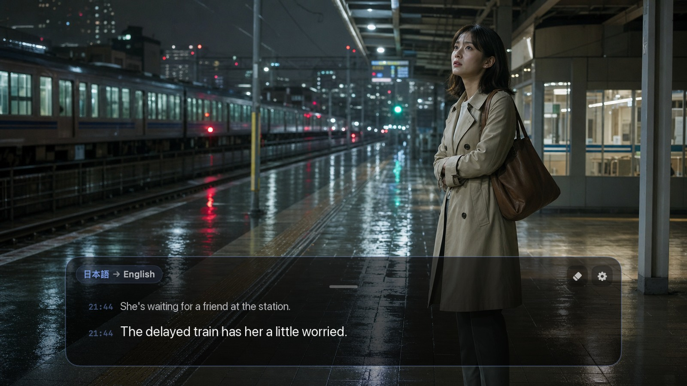
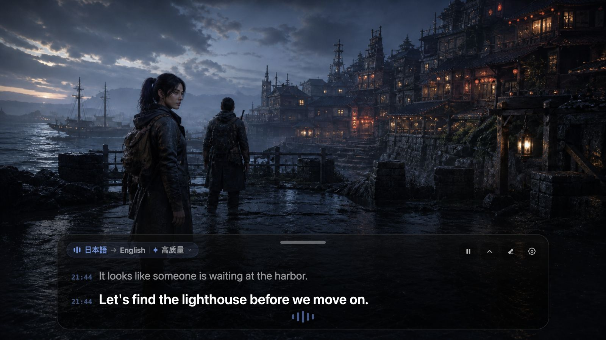
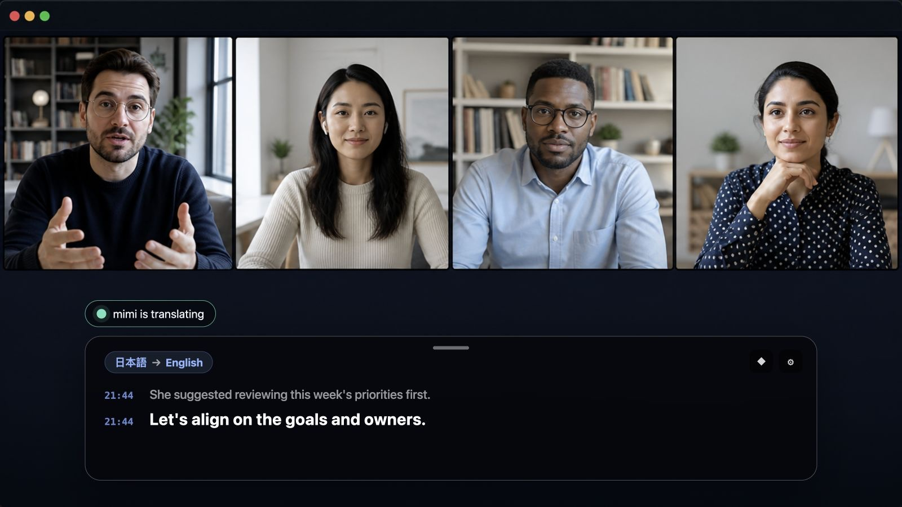

<div align="center">
  
  <h1>mimi</h1>
  <p>Live translated subtitles for anything playing on your Mac or PC.</p>
  <p>
    <a href="https://github.com/yuxino/mimi/releases/latest"><strong>Download mimi</strong></a>
    · <a href="README_ZH.md">简体中文</a>
    · <a href="README_JA.md">日本語</a>
  </p>
</div>

`mimi` comes from the Japanese word 耳（みみ, “ear”）.

Turn Chinese, Japanese, English, or Korean audio playing on your device into live subtitles, with optional translation into Simplified Chinese, English, or Japanese. Built on Tauri v2 (Rust + React); the same codebase targets macOS and Windows.

<table>
  <tr>
    <td width="33.33%"></td>
    <td width="33.33%"></td>
    <td width="33.33%"></td>
  </tr>
  <tr>
    <td align="center">Films & videos</td>
    <td align="center">Games & livestreams</td>
    <td align="center">Meetings & courses</td>
  </tr>
</table>

## Features

- **Live subtitles** — works with browsers, players, games, meetings, and desktop apps.
- **Live translation** — Turbo, Low latency, and High quality modes.
- **Flexible overlay** — move, resize, collapse, or lock the subtitle panel for click-through.
- **Multiple languages** — recognize Chinese, Japanese, English, and Korean.
- **Privacy** — no microphone, no account, and no saved audio or subtitle history.
- **Global shortcut** — **⌘ ⇧ Space** on macOS, **Ctrl+Shift+Space** on Windows to start or stop listening.

## Get started

1. Download the latest version for your platform from [Releases](https://github.com/yuxino/mimi/releases/latest).
2. Add your Alibaba Cloud Model Studio Workspace ID and API key.
3. Play something and select **Start**.

Your API key is stored in the OS keychain (macOS Keychain / Windows Credential Manager). The Workspace ID and API key must belong to the same China (Beijing) workspace. Model usage may incur charges.

[Create an API key](https://help.aliyun.com/en/model-studio/get-api-key) · [Find your Workspace ID](https://help.aliyun.com/en/model-studio/obtain-the-app-id-and-workspace-id)

### Platform notes

- **macOS**: the first session asks for Screen Recording permission (used only to capture system audio; mimi does not record your screen and excludes its own sound).
- **Windows**: captures the default playback device's full mix through WASAPI loopback — no permissions needed; mimi plays no audio, so there is no echo.

## Build from source

Requires Rust 1.85+ and Node.js 20+ (macOS also needs the Xcode Command Line Tools).

```bash
git clone https://github.com/yuxino/mimi.git
cd mimi
npm install
npm run tauri dev        # develop
./scripts/check.sh       # full check (fmt/clippy/tests/frontend build)
./scripts/package-app.sh # package (macOS: .dmg; Windows: .msi/.nsis)
```

Build the Windows package on a Windows machine (Rust's C dependencies cannot cross-compile from macOS to the MSVC target); CI runs the full Rust suite on both macOS and Windows.

## Tests

```bash
cd src-tauri && cargo test   # Rust unit tests (protocols, subtitle assembly, config, PCM…)
npm run test                 # frontend vitest
```

For UI smoke tests, run `npm run tauri dev` with `MIMI_UI_TEST=1` (demo credentials) and optionally `MIMI_AUTO_START=1` (auto-starts a session to exercise the error path).

See [CONTRIBUTING.md](CONTRIBUTING.md) and [SECURITY.md](SECURITY.md).

[MIT](LICENSE) © 2026 yuxino
