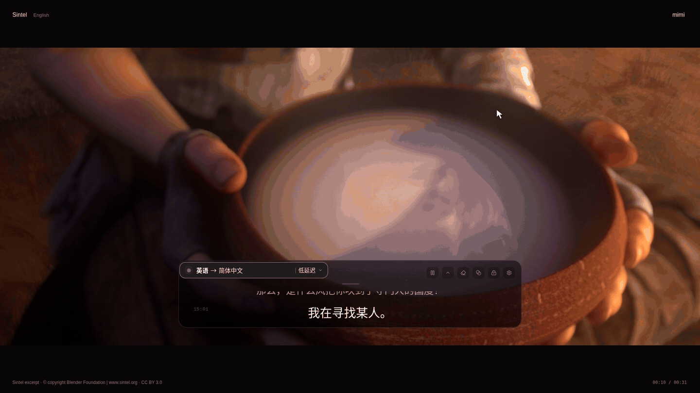

<div align="center">
  
  <h1>mimi</h1>
  <p>系统音频实时字幕与翻译，支持 Apple 芯片 macOS 13+ 和 Windows x64。</p>
  <p>
    <a href="https://github.com/yuxino/mimi/releases/latest"><strong>下载最新版</strong></a>
    · <a href="README_EN.md">English</a>
    · <a href="README_JA.md">日本語</a>
  </p>
</div>

`mimi` 取自日语「耳（みみ）」。它把设备正在播放的系统音频变成实时字幕，并按服务商能力翻译成简体中文、英语或日语。

<!-- project-demo-v1 -->
## 演示

[](docs/demos/demo.mp4)

[完整视频（MP4）](docs/demos/demo.mp4) · [演示说明](docs/demos/README.md)

字幕语言、字号、对齐与沉浸模式设置。 真实前端录制，使用示例数据。使用内置浏览器预览，不包含真实音频识别或翻译结果。
<!-- /project-demo-v1 -->

## 功能

- **实时字幕与翻译** — 采集系统输出音频；输入语言、翻译目标和质量模式随服务商而异。
- **服务配置** — 保存并切换多套服务配置，无需反复填写凭证。
- **字幕浮窗** — 支持移动、缩放、收起、暂停、点击穿透和沉浸模式。
- **签名应用内更新** — 在设置中手动检查、下载和安装更新；下载完成后必须通过签名验证。
- **隐私** — 无需 mimi 账号，不使用麦克风、不录制屏幕，也不保存音频或字幕；系统音频只发送给当前服务商。
- **快捷键** — macOS 使用 **⌘ ⇧ Space** / **⌘ ⇧ M**，Windows 使用 **Ctrl+Shift+Space** / **Ctrl+Shift+M**，分别控制监听和沉浸模式。

## 开始使用

1. 从 [Latest Release](https://github.com/yuxino/mimi/releases/latest) 下载 macOS Apple Silicon DMG 或 Windows x64 EXE / MSI；也可以从源码构建。
2. 打开「翻译服务」，选择服务商并保存凭证。
3. 播放内容，从菜单栏/系统托盘的 mimi 图标点击 **开始**；macOS 首次使用时按提示允许「屏幕与系统音频录制」。

**v1.3.8 是首个公开的应用内更新引导版本。** 从上一公开版本 v1.3.6 升级时，需要先从 GitHub Releases 手动下载安装一次；之后的版本可以在「设置 → 版本更新」中完成。Windows 安装更新时会关闭 Mimi，安装结束后需要手动重新打开。

凭证按服务配置保存在 macOS 钥匙串或 Windows 凭据管理器中；设置页只显示是否已保存。服务商调用可能产生费用。

[阿里云](https://help.aliyun.com/zh/model-studio/get-api-key) · [OpenAI](https://platform.openai.com/api-keys) · [Google Gemini](https://aistudio.google.com/app/apikey) · [Azure OpenAI](https://learn.microsoft.com/zh-cn/azure/foundry/openai/concepts/gpt-realtime-translate) · [火山引擎](https://docs.volcengine.com/docs/6561/1631605) · [腾讯云](https://cloud.tencent.com/document/api/1093/127565) · [百度翻译](https://cloud.baidu.com/doc/MT/s/Sl9p2h5k9) · [xAI](https://docs.x.ai/developers/model-capabilities/audio/speech-to-speech)

| 服务商 | 音频源语言 | 字幕目标 | 模式 |
| --- | --- | --- | --- |
| 阿里云百炼 | 自动、中文、英语、日语、韩语 | 原文、简体中文、英语、日语 | 极速、低延迟、高质量 |
| OpenAI Realtime | 自动 | 简体中文、英语、日语 | 极速 |
| Google Gemini Live Translate（预览） | 自动 | 简体中文、英语、日语 | 极速 |
| Azure OpenAI Realtime Translate | 自动 | 简体中文、英语、日语 | 极速 |
| 火山引擎豆包同传 2.0 | 中文、英语、日语 | 简体中文、英语、日语 | 极速 |
| 腾讯云实时语音翻译 | 中文、英语、日语、韩语 | 简体中文、英语、日语 | 极速 |
| 百度实时语音翻译 | 中文、英语、日语、韩语 | 简体中文、英语、日语 | 极速 |
| xAI Grok Voice | 自动 | 简体中文、英语、日语 | 极速（回合式） |

Gemini、Azure OpenAI、豆包、腾讯云、百度和 xAI 已通过协议、模拟 WebSocket 与 UI 逻辑测试；付费账号的端到端质量和延迟尚未逐一验收。

### 平台支持

- **Apple 芯片 macOS 13+**：提供未经 Apple 公证的临时签名 DMG；若首次打开被拦截，请在「系统设置 → 隐私与安全性」中选择「仍要打开」。系统可能在更新后重新请求录音或钥匙串权限。
- **Windows x64**：系统音频采集、Windows 凭据管理器、系统托盘、字幕浮窗和全局快捷键均已实现。Release 提供未签名的预览版 MSI 和 NSIS EXE，公开 x64 包的真机端到端验收仍在进行；SmartScreen 可能显示警告。

## 从源码构建

需要 Rust 1.88+，以及 Node.js 20.19.x、22.13+ 或 24+。macOS 还需 Xcode Command Line Tools 和 `mimi Local Development` 身份或显式 `MIMI_CODESIGN_IDENTITY`。

```bash
git clone https://github.com/yuxino/mimi.git
cd mimi
npm ci
npm run tauri:dev        # Windows：使用独立开发配置运行
./scripts/dev-app.sh     # macOS：以稳定应用身份运行
./scripts/check.sh       # 完整检查（fmt/clippy/测试/前端构建）
```

Windows 安装包需在 Windows 上运行 `npm run tauri -- build -- --locked` 构建；macOS 可使用 `./scripts/package-app.sh`。CI 会在 macOS、Windows x64 和 Windows ARM64 上进行测试或启动检查。

更多内容见 [CONTRIBUTING.md](CONTRIBUTING.md) 和 [SECURITY.md](SECURITY.md)。

[MIT](LICENSE) © 2026 yuxino
