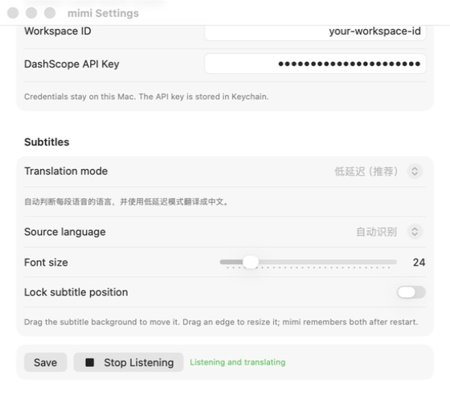

<div align="center">
  
  <h1>mimi</h1>
  <p><strong>听见声音，马上翻译。macOS 原生实时双语字幕。</strong></p>
  <p>
    <a href="README.md">简体中文</a> ·
    <a href="README_EN.md">English</a>
  </p>
</div>


`mimi` 会听取 Mac 正在播放的系统音频，把英语、日语或韩语实时翻译成简体中文，并显示在始终置顶的字幕窗口中。它不需要浏览器扩展，不使用麦克风；安装后填入阿里云百炼的 Workspace ID 和 API Key 就能开始。

> 当前为早期版本，应用尚未经过 Apple 公证。首次打开时需要在 macOS 中手动确认。

## 为什么是 mimi

- **足够快**：识别草稿优先显示，定稿使用更自然的翻译模型。
- **更像人话**：保留有意义的语气词，并参考最近几句改善上下文衔接。
- **自动判断语言**：同一场视频中可自动识别英语、日语和韩语。
- **原生字幕窗**：可移动、缩放、锁定、穿透点击，并记住位置。
- **字幕不会闪没**：保留最近译文，也可随时从字幕窗手动清空。
- **隐私清楚**：不注册账号、不做分析、不录音、不在本地保存字幕。
- **凭证留在 Mac**：API Key 存在 macOS 钥匙串，不写入项目或应用包。

## 三分钟开始

### 1. 准备配置

- macOS 14 或更新版本
- 阿里云百炼华北 2（北京）地域的 Workspace ID 和 API Key

1. 在阿里云百炼控制台选择 **华北 2（北京）**。
2. 按[官方说明创建 API Key](https://help.aliyun.com/zh/model-studio/get-api-key)，建议使用默认业务空间。
3. 在控制台右上角复制 Workspace ID，具体位置见[官方 Workspace ID 说明](https://help.aliyun.com/zh/model-studio/obtain-the-app-id-and-workspace-id)。

Workspace ID 与 API Key 必须属于同一业务空间。API Key 会产生模型调用费用，请勿提交到 Issue、日志或截图中。

### 2. 下载并打开

1. 从 [Releases](https://github.com/yuxino/mimi/releases/latest) 下载 `mimi-v0.1.0-macos.zip`。
2. 解压并把 `mimi.app` 移到“应用程序”文件夹。
3. 首次打开如果被 macOS 拦截，前往“系统设置 → 隐私与安全性”，点击“仍要打开”。

首次打开后：

1. 在设置中粘贴 Workspace ID 和 DashScope API Key。
2. 点击 **Save**，再点击 **Start Listening**。
3. 允许 macOS 的“屏幕与系统音频录制”权限。
4. 如果系统要求重启应用，退出后重新打开 mimi。



<details>
<summary>从源码构建</summary>

需要 Xcode 16，或安装了 Swift 6 的 Xcode Command Line Tools。

```bash
git clone https://github.com/yuxino/mimi.git
cd mimi
./scripts/package-app.sh
open dist/mimi.app
```

</details>

## 日常使用

- 默认的“自动识别”适合语言会变化的视频。
- 单一语言内容可手动选择 English、日本語或한국어。
- 拖动字幕背景可移动窗口，拖动边缘可调整大小。
- 锁定位置后字幕窗会穿透鼠标，不影响视频操作。
- 鼠标移到字幕窗右上角，可清空字幕或打开设置。
- 菜单栏也提供显示字幕窗、清空字幕和退出等操作。

如果同时看到另一块写着“正在翻译”的字幕框，那通常是 Chrome 自带的实时字幕。前往 Chrome 的“设置 → 无障碍”，关闭“实时字幕/实时翻译”即可。

## 工作方式

低延迟模式把任务拆成两个互不阻塞的通道：

1. Qwen 实时 ASR 持续输出原文草稿。
2. 草稿使用 Qwen-MT-Lite 快速翻译。
3. 确认后的句子使用 Qwen-MT-Flash 生成更自然的定稿。
4. 最近三组确认字幕作为有限翻译记忆，改善连续对话。

系统音频由 Apple ScreenCaptureKit 在本机采集；音频会发送到用户自己配置的阿里云百炼工作空间。mimi 不提供中转服务器。

## 开发与测试

```bash
# 运行无第三方依赖的核心测试
swift run mimi-core-tests

# 严格 Release 构建
swift build -c release -Xswiftc -warnings-as-errors

# 打包、签名并验证应用
./scripts/package-app.sh
```

项目结构：

- `Sources/MimiCore`：实时协议、翻译队列、字幕状态与 PCM 编码。
- `Sources/MimiApp`：SwiftUI/AppKit 界面、系统音频、钥匙串和悬浮窗。
- `Sources/MimiReplay`：真实音频回放与延迟指标工具。
- `Tests/MimiCoreTests`：确定性的可执行测试套件。
- `docs/plans`：已验证的产品设计与实现记录。

## 常见问题

**为什么听不到视频？**

确认已经授予“屏幕与系统音频录制”权限，并在授权后重新启动 mimi。

**为什么提示 401 或 403？**

确认 Workspace ID 与 API Key 都来自华北 2（北京）的同一个业务空间，并且 Key 有权调用相关模型。

**会上传麦克风或保存字幕吗？**

不会。mimi 只采集 Mac 正在播放的系统音频，不请求麦克风；应用本身不保存音频或字幕历史。

**为什么每次重新构建都可能再次请求权限？**

没有本地稳定签名证书时，脚本会使用临时签名。macOS 可能把新构建识别成另一个应用。详见[开发说明](CONTRIBUTING.md)。

## 参与贡献

欢迎提交 Issue 和 Pull Request。开始前请阅读 [CONTRIBUTING.md](CONTRIBUTING.md)；安全问题请按 [SECURITY.md](SECURITY.md) 私下报告，不要公开任何 API Key。

## 许可证

[MIT](LICENSE) © 2026 yuxino
