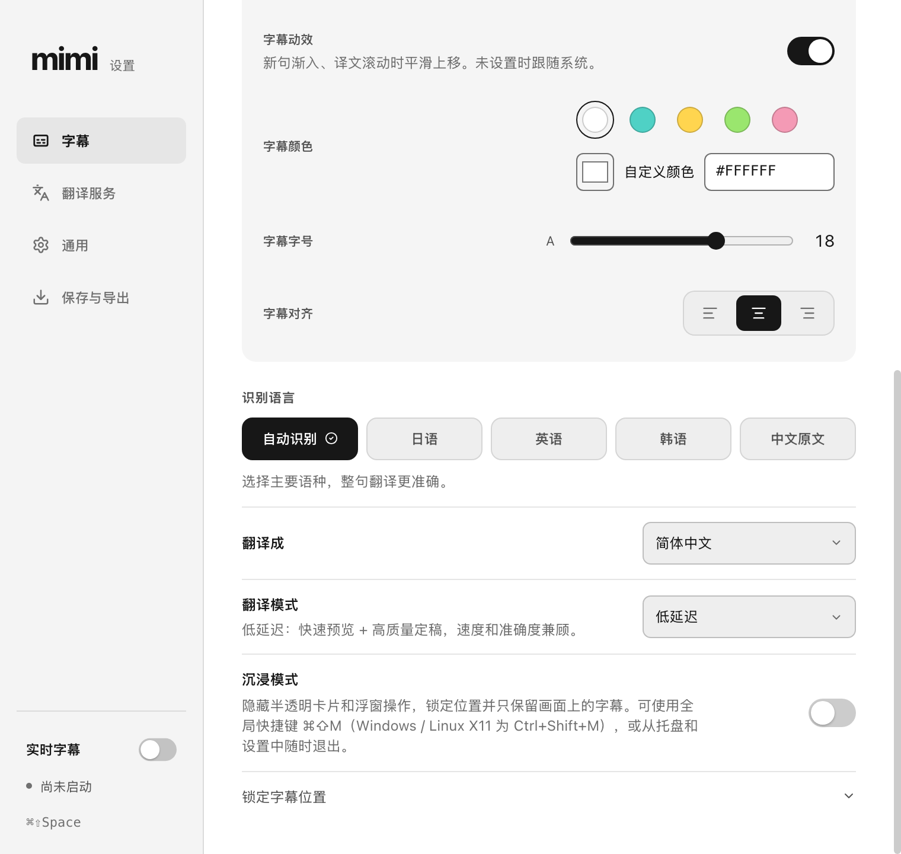
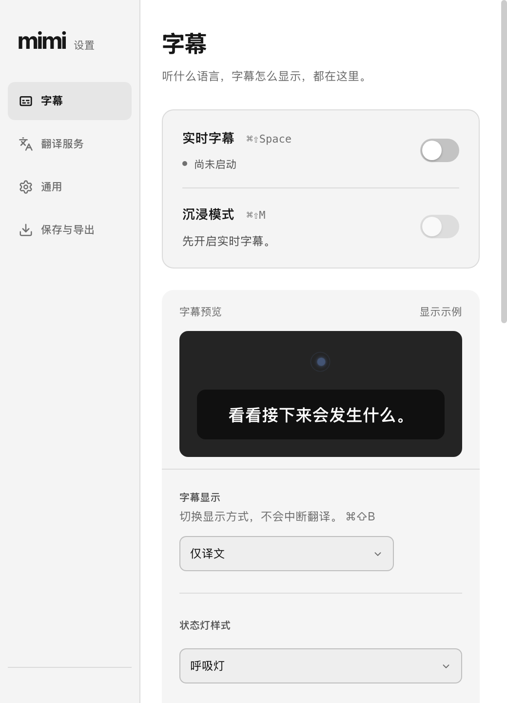
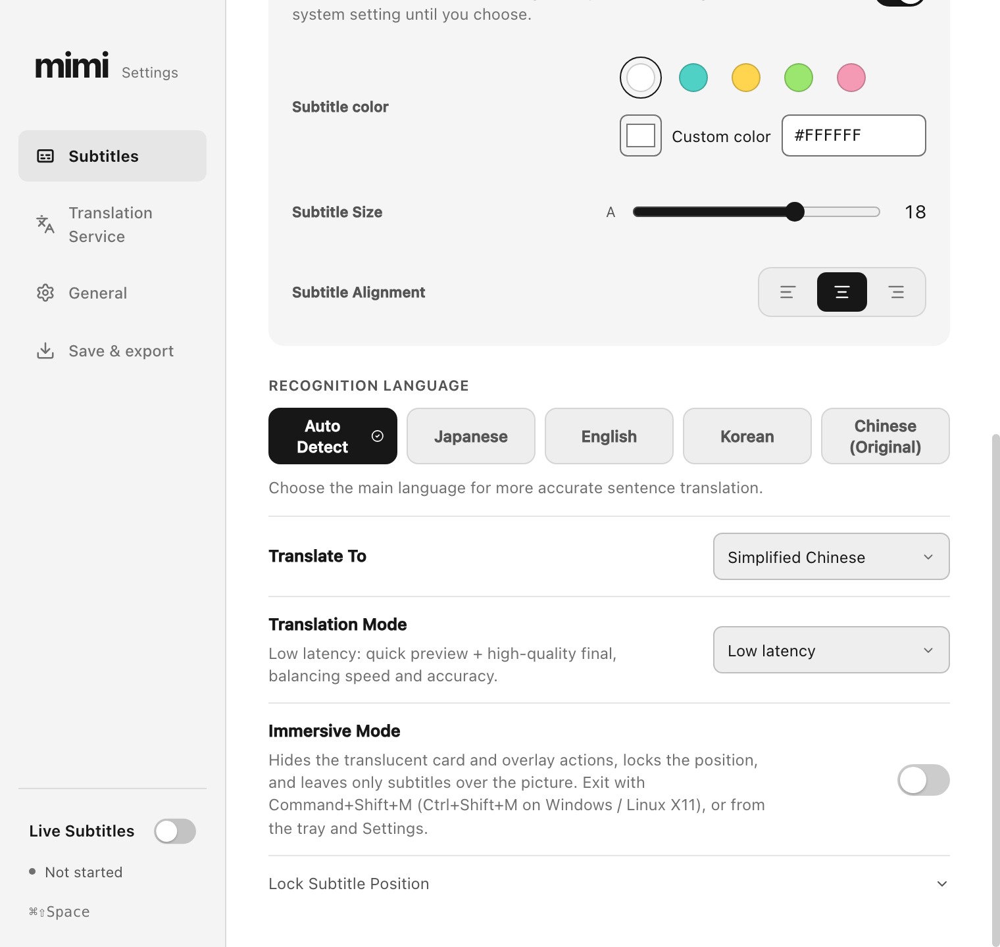
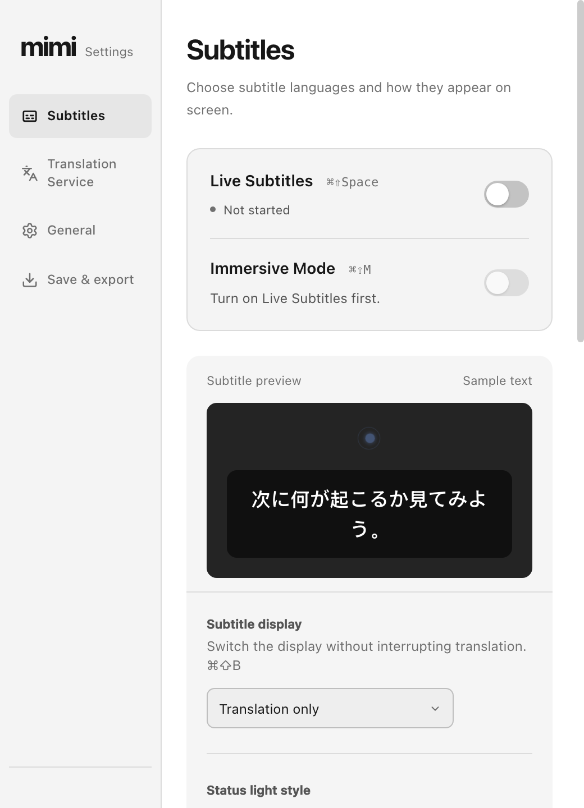
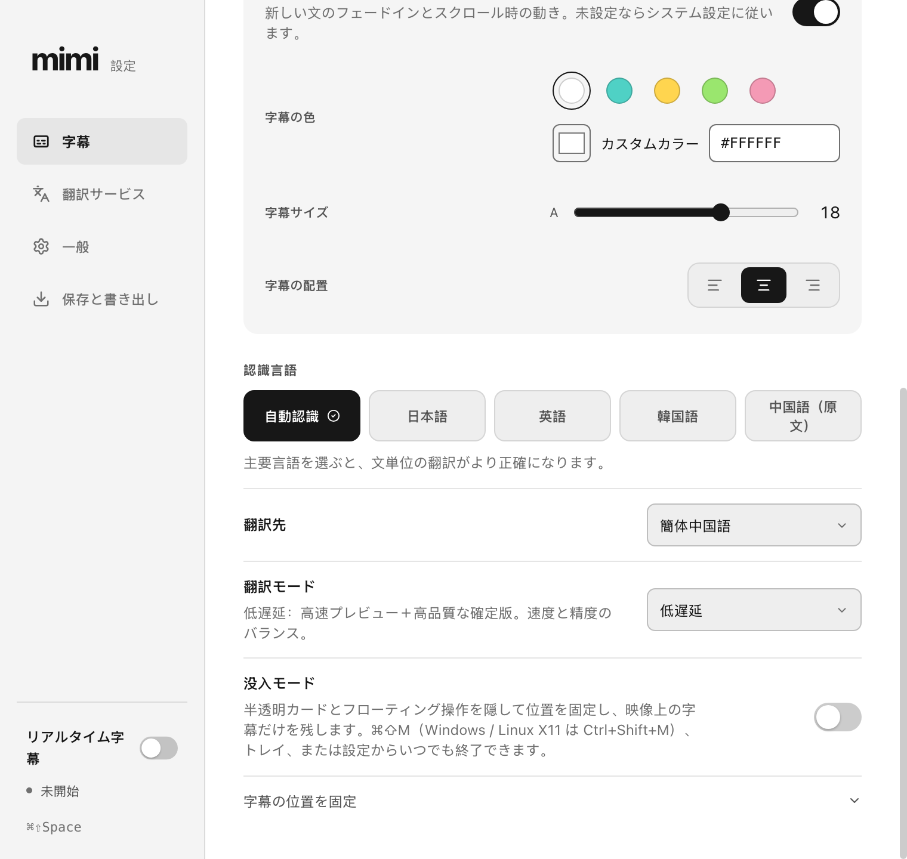
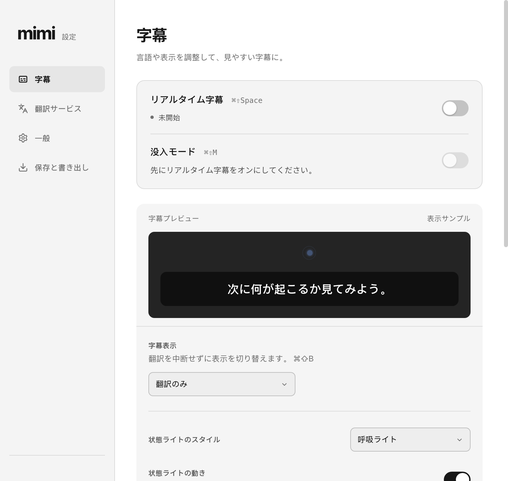
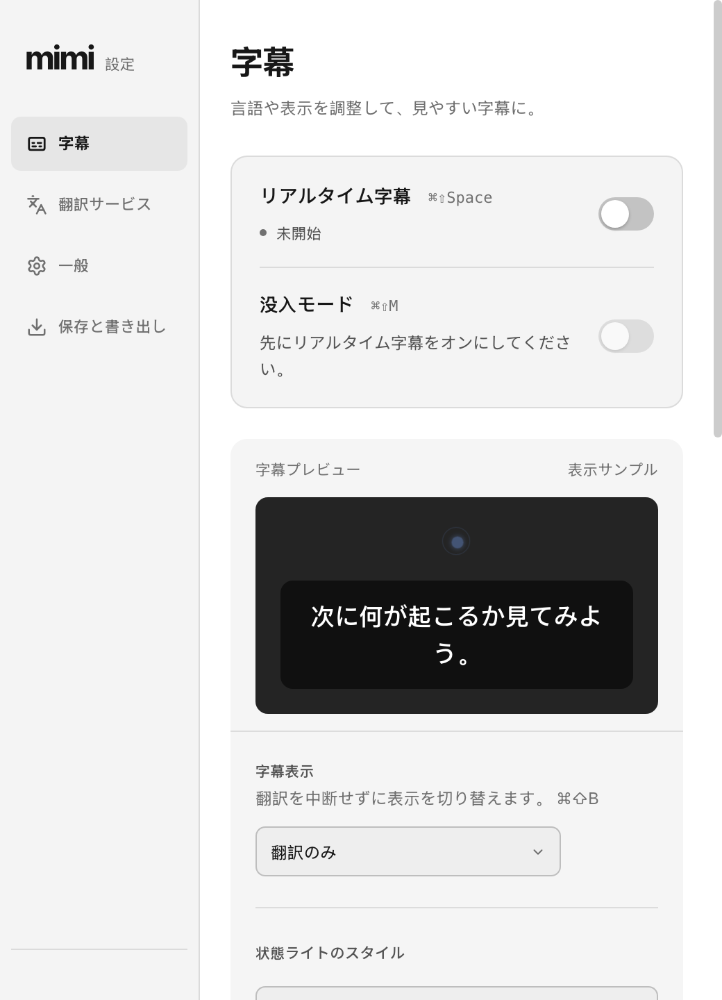

# 实时字幕与沉浸模式：前端视觉候选

Before `8e4432efd2a1dd924fccedd2bbd2ed84cf876ebc`；After
`6b53182385ce06f03ddcbfa44b0b65f5742cc331`。Mac 实际无窗口 Chromium，
真实 React/CSS 组件，合成浏览器配置/会话，不是原生安装包、真实音源或服务认证。
白色主题、760×720 和 520×720 CSS px，DPR2，原图分别1520×1440与1040×1440。

Before 根组件/i18n/settings CSS 来自 exact 8e4432e，仅重定位 import；支持模块共用。
旧页面滚动至沉浸行，新页面顶部直接呈现同一控制卡。相同窗口/语言/主题/合成设置，
不是伪造同一个滚动位置。用户原截图仅用于定位问题，未在此发布。

改动：将实时字幕总开关与沉浸显示放在内容区顶部；平台快捷键就近显示；未开启字幕时
不能进入沉浸，但既有沉浸状态始终可退出。缺凭据时提供配置入口。三语说明缩短，退出
方式保留。挂载不会启动会话或改变设置。

61 项浏览器交互断言通过：三语/两宽度、同区控制、无溢出、禁用状态、明确点击后的合成
开始/沉浸/停止/退出、缺凭据配置导航。251 前端测试、类型检查、构建通过，lint零错误
及既有SoftwareUpdate警告。待用户视觉反馈；新原生包/正常服务仍待验。没有Rust编译、
安装、真实凭据读取、ACL/TCC修改或收费服务。

## 中文

| Before 760px | After 760px |
| --- | --- |
|  |  |

## English

| Before 760px | After 760px |
| --- | --- |
|  |  |

## 日本語

| Before 760px | After 760px |
| --- | --- |
|  |  |

还保留三张before窄窗原图、results.json。previous-pr-body.md 是此前完整公开正文，
用于保存旧 CI 历史细节；现 PR 可以压缩旧 CI prose 而不丢失追溯，不移走任何原内嵌截图。
