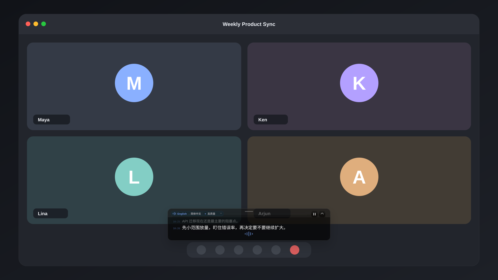

<div align="center">
  
  <h1>mimi</h1>
  <p>Live translated subtitles on Mac</p>
  <p>
    <a href="https://github.com/yuxino/mimi/releases/latest"><strong>Download mimi</strong></a>
    · <a href="README.md">简体中文</a>
    · <a href="README_JA.md">日本語</a>
  </p>
</div>

The name mimi comes from the reading of the Japanese word 耳（みみ, “ear”）, written in roman letters as *mimi*.

It listens to audio playing on your Mac and turns Chinese, Japanese, English, or Korean into live original-language subtitles, or translates it into Simplified Chinese, English, or Japanese. It works with browsers, media players, online meetings, and desktop apps.

Move the subtitle window, resize it freely from any edge, or lock it to click through. The current line stays clear while earlier dialogue fades back with a quiet timestamp. When someone keeps talking, mimi breaks the passage into readable subtitle-sized lines and updates only the active tail.

<table>
  <tr>
    <td width="50%"></td>
    <td width="50%"></td>
  </tr>
  <tr>
    <td align="center">Watch films without native subtitles</td>
    <td align="center">Follow dialogue-heavy narrative games</td>
  </tr>
  <tr>
    <td width="50%"></td>
    <td width="50%"></td>
  </tr>
  <tr>
    <td align="center">Keep up with mature and late-night stories</td>
    <td align="center">Understand livestreams, podcasts, and travel videos</td>
  </tr>
</table>

### It works in meetings too

<div align="center">
  
</div>

mimi turned out to be useful for more than videos.

If the other person’s voice is playing through your Mac in Zoom, Meet, Teams, Feishu, a webinar, or an online class, mimi can subtitle it the same way. It is handy for overseas interviews, cross-language meetings, or simply when an accent is hard to catch.

mimi captures system audio rather than your microphone, so it does not record your own voice. During a meeting you can pause and resume from the subtitle panel, collapse it into a small status bar, switch the recognition language from the top-left control, and let mimi reconnect automatically after a brief network interruption.

## Get started

1. Download the latest version from [Releases](https://github.com/yuxino/mimi/releases/latest)
2. Add your Alibaba Cloud Model Studio Workspace ID and API key
3. Play a video or join a meeting, then select **Start Listening**

The current UI lets you choose Chinese original audio, English, Japanese, or Korean as the recognition language. Subtitles can show the original words directly or translate them into Simplified Chinese, English, or Japanese. When translation is enabled, the current build uses the high-quality mode.

> mimi is not yet notarized by Apple. If macOS blocks the first launch, open System Settings → Privacy & Security and select **Open Anyway**.

## Just subtitles. Nothing extra.

mimi never uses your microphone, asks for an account, or saves recordings and subtitle history. Your API key stays in macOS Keychain.

Confirmed lines stay in the subtitle panel while older dialogue gently fades back and the active line remains prominent. Continuous speech is split by punctuation and length into readable subtitle-sized chunks so the whole paragraph does not keep jumping around.

[Create an API key](https://help.aliyun.com/en/model-studio/get-api-key) · [Find your Workspace ID](https://help.aliyun.com/en/model-studio/obtain-the-app-id-and-workspace-id)

> The Workspace ID and API key must belong to the same China (Beijing) workspace. Model usage may incur charges.

## A few useful details

- `⌘ ⇧ Space` quickly starts or stops live subtitles
- Drag the short handle at the top center to move the window; resize freely from any edge or corner
- Double-click the top handle to collapse the panel into a compact status bar; double-click again or use the expand button to restore it
- Pause or resume directly from the top-right controls without clearing the subtitles already on screen
- Select the top-left language status to switch the recognition language without opening Settings
- The language indicator and bottom waveform distinguish listening, recognizing, translating, and paused states
- Faint timestamps mark confirmed lines while the current line stays prominent
- Lock the panel to click through it and keep using the video or meeting underneath
- Use the eraser in the top-right corner to clear the current subtitles
- Brief connection failures trigger automatic recovery without intentionally clearing the existing subtitles
- If two subtitle panels appear, disable Chrome Live Caption / Live Translate

<details>
<summary>Build from source</summary>

Requires macOS 14+ and Xcode 16 or Xcode Command Line Tools with Swift 6.

```bash
git clone https://github.com/yuxino/mimi.git
cd mimi
swift run mimi-core-tests
swift build -c release -Xswiftc -warnings-as-errors
./scripts/package-app.sh
open dist/mimi.app
```

</details>

## Contributing

Issues and pull requests are welcome. Read [CONTRIBUTING.md](CONTRIBUTING.md) before starting and report vulnerabilities privately according to [SECURITY.md](SECURITY.md).

[MIT](LICENSE) © 2026 yuxino
