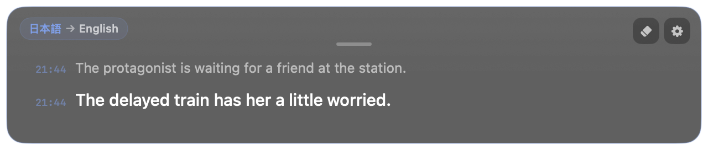

<div align="center">
  
  <h1>mimi</h1>
  <p>Live translated subtitles on Mac</p>
  <p>
    <a href="https://github.com/yuxino/mimi/releases/latest"><strong>Download mimi</strong></a>
    · <a href="README.md">简体中文</a>
    · <a href="README_JA.md">日本語</a>
  </p>
</div>

The name mimi comes from the reading of the Japanese word 耳（みみ, “ear”）, written in roman letters as *mimi*.

It listens to audio playing on your Mac and turns Chinese, Japanese, English, or Korean into live original-language subtitles, or translates it into Simplified Chinese, English, or Japanese. It works with browsers, media players, online meetings, and desktop apps.

Move the subtitle window, resize it freely from any edge, or lock it to click through. The current line stays clear while earlier dialogue fades back with a quiet timestamp. When someone keeps talking, mimi breaks the passage into readable subtitle-sized lines and updates only the active tail.

<table>
  <tr>
    <td width="50%"></td>
    <td width="50%"></td>
  </tr>
  <tr>
    <td align="center">Watch films without native subtitles</td>
    <td align="center">Follow dialogue-heavy narrative games</td>
  </tr>
  <tr>
    <td width="50%"></td>
    <td width="50%"></td>
  </tr>
  <tr>
    <td align="center">Keep up with mature and late-night stories</td>
    <td align="center">Understand livestreams, podcasts, and travel videos</td>
  </tr>
</table>

### Keep it open during a meeting

Zoom, Google Meet, Teams, Feishu, browser-based webinars, or online classes all work the same way: if the other person’s voice is playing through your Mac, mimi can turn it into subtitles floating over the window. It is useful for overseas interviews, cross-language meetings, or simply when an accent is hard to catch.

mimi captures system audio rather than your microphone, so it helps you understand what the computer is playing. It does not record your own voice and it is not a meeting recorder or note-taking app.

<div align="center">
  
  <br>
  <sub>The current subtitle panel keeps language status, recent confirmed lines, and the active line in one small floating window.</sub>
</div>

## Get started

1. Download the latest version from [Releases](https://github.com/yuxino/mimi/releases/latest)
2. Add your Alibaba Cloud Model Studio Workspace ID and API key
3. Play a video or join a meeting, then select **Start Listening**

mimi can detect the language automatically or let you choose Chinese, English, Japanese, or Korean manually. Subtitles can show the original words directly, or translate them into Simplified Chinese, English, or Japanese.

Two translation modes are available: **Low Latency** and **High Quality**. Low Latency fits meetings and interviews where keeping up matters most; for films and longer content, choose whichever feels better.

> mimi is not yet notarized by Apple. If macOS blocks the first launch, open System Settings → Privacy & Security and select **Open Anyway**.

## Just subtitles. Nothing extra.

mimi never uses your microphone, asks for an account, or saves recordings and subtitle history. Your API key stays in macOS Keychain.

For translated subtitles, mimi shows a stable preview before the final translation takes over. Completed subtitle-sized lines stay put while only the active tail changes, avoiding constant full-paragraph reflow.

[Create an API key](https://help.aliyun.com/en/model-studio/get-api-key) · [Find your Workspace ID](https://help.aliyun.com/en/model-studio/obtain-the-app-id-and-workspace-id)

> The Workspace ID and API key must belong to the same China (Beijing) workspace. Model usage may incur charges.

## A few useful details

- Drag the short handle at the top center to move the window; resize freely from any edge or corner
- Choose a subtitle size from 14–20; narrower windows wrap text naturally
- Continuous speech is split by punctuation and length, with new lines appended as they become readable
- The top-left label shows the detected and subtitle languages
- Faint timestamps mark confirmed lines while the current line stays prominent
- Lock the panel to click through it and keep using the video or meeting underneath
- Use the eraser in the top-right corner to clear the current subtitles
- If two subtitle panels appear, disable Chrome Live Caption / Live Translate

<details>
<summary>Build from source</summary>

Requires macOS 14+ and Xcode 16 or Xcode Command Line Tools with Swift 6.

```bash
git clone https://github.com/yuxino/mimi.git
cd mimi
swift run mimi-core-tests
swift build -c release -Xswiftc -warnings-as-errors
./scripts/package-app.sh
open dist/mimi.app
```

</details>

## Contributing

Issues and pull requests are welcome. Read [CONTRIBUTING.md](CONTRIBUTING.md) before starting and report vulnerabilities privately according to [SECURITY.md](SECURITY.md).

[MIT](LICENSE) © 2026 yuxino
