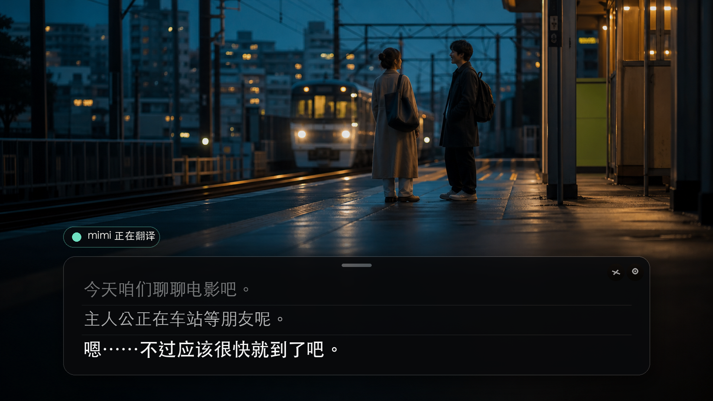
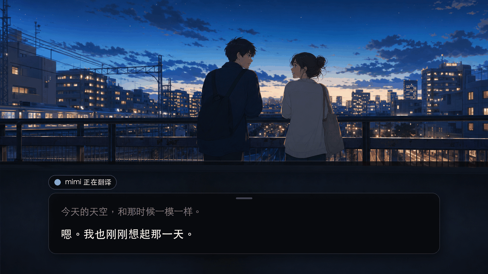
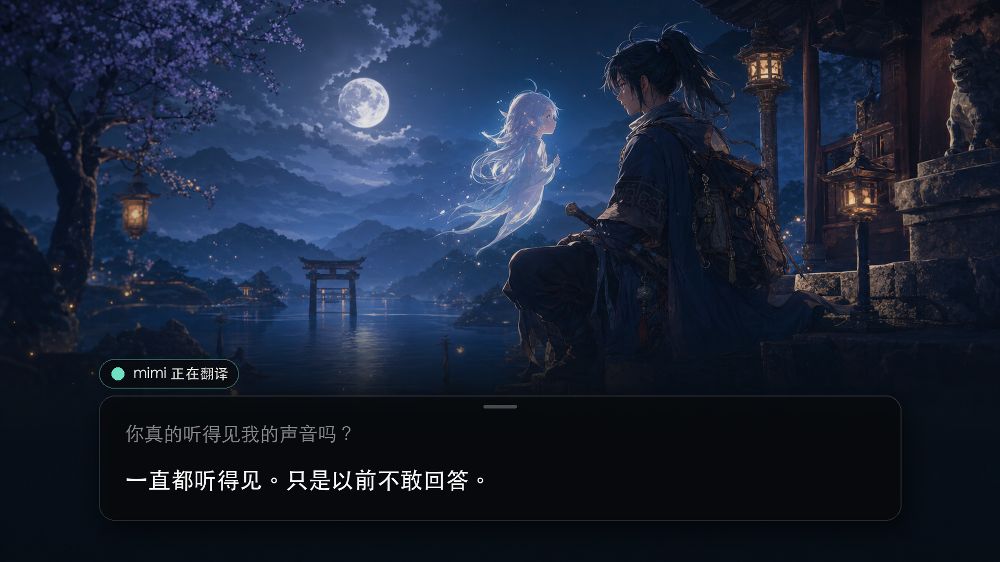

<div align="center">
  
  <h1>mimi</h1>
  <p><strong>Watch it now. Don't wait for subtitles.</strong></p>
  <p>mimi adds live Chinese subtitles to foreign-language video playing on your Mac.</p>
  <p>
    <a href="https://github.com/yuxino/mimi/releases/latest"><strong>Download mimi</strong></a>
    · <a href="README.md">简体中文</a>
  </p>
</div>



## Press play. The subtitles follow.

No subtitle files. No translation window. No pausing every time a line gets away from you.

mimi moves with the dialogue. A line appears as it is spoken, then settles into place as the sentence becomes clear. Pauses and tone stay part of it.

The current line stays clear while earlier dialogue fades back. Put the subtitles where they feel right, lock the window, and keep watching.

## The next episode starts now

<table>
  <tr>
    <td width="50%"></td>
    <td width="50%"></td>
  </tr>
</table>

Anime, films, and interviews work in the browser or player you already use.


## Get started

1. Download the latest version from [Releases](https://github.com/yuxino/mimi/releases/latest)
2. Add your Alibaba Cloud Model Studio Workspace ID and API key
3. Play a video and select **Start Listening**

mimi translates English, Japanese, and Korean into Simplified Chinese. Let it detect the language or choose one yourself.

> mimi is not yet notarized by Apple. If macOS blocks the first launch, open System Settings → Privacy & Security and select **Open Anyway**.

## Just subtitles. Nothing extra.

mimi never uses your microphone, asks for an account, or saves recordings and subtitle history. Your API key stays in macOS Keychain.

[Create an API key](https://help.aliyun.com/en/model-studio/get-api-key) · [Find your Workspace ID](https://help.aliyun.com/en/model-studio/obtain-the-app-id-and-workspace-id)

> The Workspace ID and API key must belong to the same China (Beijing) workspace. Model usage may incur charges.

## A few useful details

- Drag the panel background to move it; drag an edge to resize it
- Lock the panel to click through it
- Use the eraser in the top-right corner to clear the current subtitles
- If two subtitle panels appear, disable Chrome Live Caption / Live Translate

<details>
<summary>Build from source</summary>

Requires macOS 14+ and Xcode 16 or Xcode Command Line Tools with Swift 6.

```bash
git clone https://github.com/yuxino/mimi.git
cd mimi
swift run mimi-core-tests
swift build -c release -Xswiftc -warnings-as-errors
./scripts/package-app.sh
open dist/mimi.app
```

</details>

## Contributing

Issues and pull requests are welcome. Read [CONTRIBUTING.md](CONTRIBUTING.md) before starting and report vulnerabilities privately according to [SECURITY.md](SECURITY.md).

[MIT](LICENSE) © 2026 yuxino
