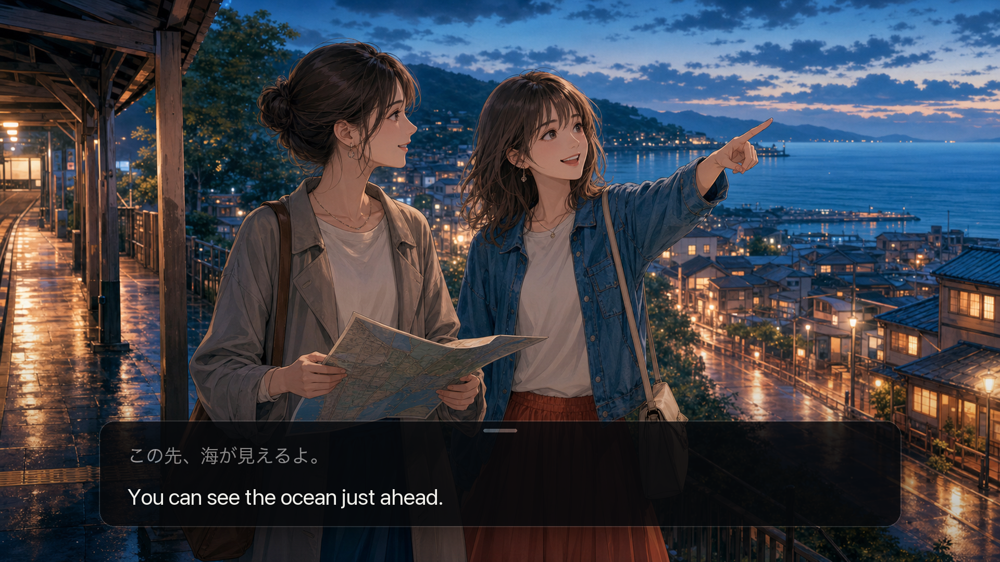
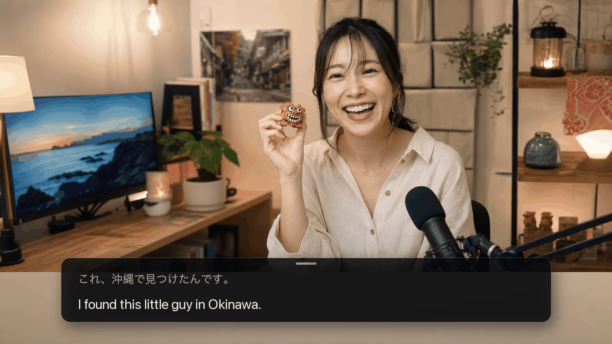

<div align="center">
  
  <h1>mimi</h1>
  <p>Live translated subtitles on Mac</p>
  <p>
    <a href="https://github.com/yuxino/mimi/releases/latest"><strong>Download mimi</strong></a>
    · <a href="README.md">简体中文</a>
    · <a href="README_JA.md">日本語</a>
  </p>
</div>

<br>


<br>

mimi is Japanese for “ears.”

It listens to audio playing on your Mac and turns Japanese, English, or Korean into live subtitles in Simplified Chinese, English, or Japanese. It works with browsers, media players, and desktop apps.

Move, resize, or lock the subtitle window. The current line stays clear while earlier dialogue gently fades back.

<table>
  <tr>
    <td width="50%"></td>
    <td width="50%"></td>
  </tr>
  <tr>
    <td align="center">Play story-rich games in another language</td>
    <td align="center">Follow livestreams as they happen</td>
  </tr>
</table>

## Get started

1. Download the latest version from [Releases](https://github.com/yuxino/mimi/releases/latest)
2. Add your Alibaba Cloud Model Studio Workspace ID and API key
3. Play a video and select **Start Listening**

mimi understands English, Japanese, and Korean. Let it detect what is playing, then show the original words or translate them into Simplified Chinese, English, or Japanese.

> mimi is not yet notarized by Apple. If macOS blocks the first launch, open System Settings → Privacy & Security and select **Open Anyway**.

## Just subtitles. Nothing extra.

mimi never uses your microphone, asks for an account, or saves recordings and subtitle history. Your API key stays in macOS Keychain.

[Create an API key](https://help.aliyun.com/en/model-studio/get-api-key) · [Find your Workspace ID](https://help.aliyun.com/en/model-studio/obtain-the-app-id-and-workspace-id)

> The Workspace ID and API key must belong to the same China (Beijing) workspace. Model usage may incur charges.

## A few useful details

- Drag the panel background to move it; drag an edge to resize it
- The top-left label shows the detected and subtitle languages
- Lock the panel to click through it
- Use the eraser in the top-right corner to clear the current subtitles
- If two subtitle panels appear, disable Chrome Live Caption / Live Translate

<details>
<summary>Build from source</summary>

Requires macOS 14+ and Xcode 16 or Xcode Command Line Tools with Swift 6.

```bash
git clone https://github.com/yuxino/mimi.git
cd mimi
swift run mimi-core-tests
swift build -c release -Xswiftc -warnings-as-errors
./scripts/package-app.sh
open dist/mimi.app
```

</details>

## Contributing

Issues and pull requests are welcome. Read [CONTRIBUTING.md](CONTRIBUTING.md) before starting and report vulnerabilities privately according to [SECURITY.md](SECURITY.md).

[MIT](LICENSE) © 2026 yuxino
