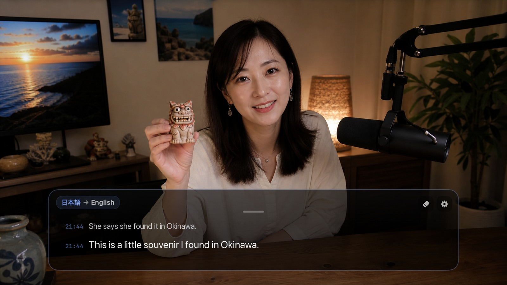
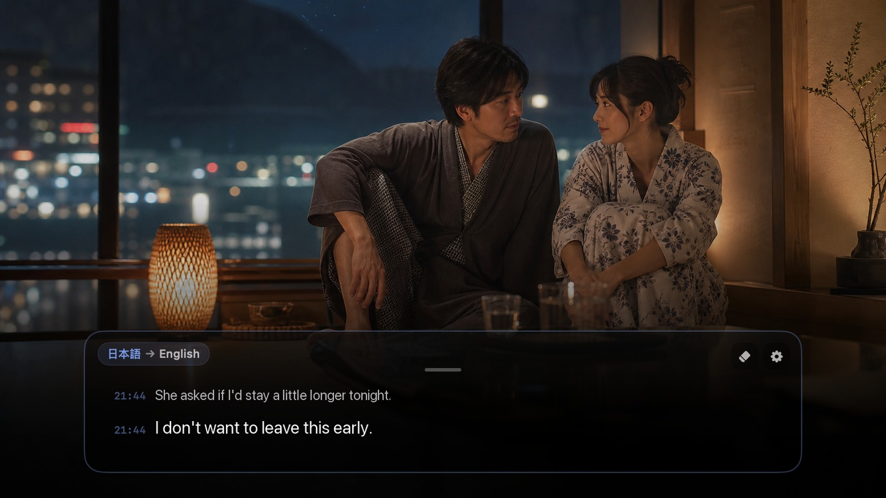

<div align="center">
  
  <h1>mimi</h1>
  <p>Live translated subtitles on Mac</p>
  <p>
    <a href="https://github.com/yuxino/mimi/releases/latest"><strong>Download mimi</strong></a>
    · <a href="README.md">简体中文</a>
    · <a href="README_JA.md">日本語</a>
  </p>
</div>

The name mimi comes from the Japanese word 耳（みみ, “ear”）. It turns Chinese, Japanese, English, or Korean audio playing on your Mac into live original-language subtitles, or translates it into Simplified Chinese, English, or Japanese.

It works with browsers, media players, online meetings, courses, and desktop apps.

<table>
  <tr>
    <td width="33.33%"></td>
    <td width="33.33%"></td>
    <td width="33.33%"></td>
  </tr>
  <tr>
    <td align="center">Watch films without native subtitles</td>
    <td align="center">Follow dialogue-heavy narrative games</td>
    <td align="center">Understand livestreams, podcasts, and travel videos</td>
  </tr>
  <tr>
    <td width="33.33%"></td>
    <td width="33.33%"></td>
    <td width="33.33%"></td>
  </tr>
  <tr>
    <td align="center">Keep up with foreign-language short dramas</td>
    <td align="center">Join cross-language online meetings</td>
    <td align="center">Learn from online courses and lectures</td>
  </tr>
</table>

## Highlights

- Move, resize, lock, or collapse the subtitle panel
- Keep the current line prominent while confirmed subtitles fade with timestamps
- Pause, clear, switch recognition languages, and recover from brief disconnects
- Press **⌘ ⇧ Space** to start or stop live subtitles

## Get started

1. Download the latest version from [Releases](https://github.com/yuxino/mimi/releases/latest)
2. Add your Alibaba Cloud Model Studio Workspace ID and API key
3. Play a video, join a meeting, or open an online course, then select **Start Listening**

> mimi is not yet notarized by Apple. If macOS blocks the first launch, open System Settings → Privacy & Security and select **Open Anyway**.

## Privacy and setup

mimi never uses your microphone, asks for an account, or saves recordings and subtitle history. Your API key stays in macOS Keychain.

[Create an API key](https://help.aliyun.com/en/model-studio/get-api-key) · [Find your Workspace ID](https://help.aliyun.com/en/model-studio/obtain-the-app-id-and-workspace-id)

> The Workspace ID and API key must belong to the same China (Beijing) workspace. Model usage may incur charges.

## Tips

- Drag the short handle at the top center to move the window; resize freely from any edge or corner
- Double-click the top handle to collapse or expand it
- Lock the panel to click through it and keep using the video or meeting underneath
- Switch languages from the top left; pause or clear subtitles from the top right
<details>
<summary>Build from source</summary>

Requires macOS 14+ and Xcode 16 or Xcode Command Line Tools with Swift 6.

```bash
git clone https://github.com/yuxino/mimi.git
cd mimi
swift run mimi-core-tests
swift build -c release -Xswiftc -warnings-as-errors
./scripts/package-app.sh
open dist/mimi.app
```

</details>

## Contributing

Issues and pull requests are welcome. Read [CONTRIBUTING.md](CONTRIBUTING.md) before starting and report vulnerabilities privately according to [SECURITY.md](SECURITY.md).

[MIT](LICENSE) © 2026 yuxino
