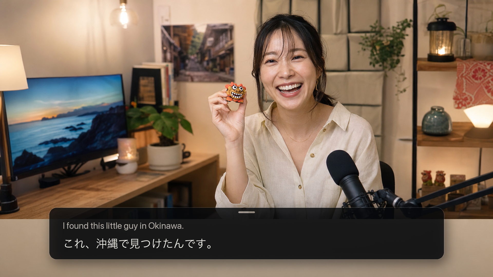

<div align="center">
  
  <h1>mimi</h1>
  <p>Macのリアルタイム翻訳字幕</p>
  <p>
    <a href="https://github.com/yuxino/mimi/releases/latest"><strong>mimiをダウンロード</strong></a>
    · <a href="README.md">简体中文</a>
    · <a href="README_EN.md">English</a>
  </p>
</div>

<br>


<br>

mimi（みみ）は、日本語で「耳」という意味です。

Macで再生中の音声を聞き取り、英語・日本語・韓国語を、簡体字中国語・英語・日本語の字幕にリアルタイムで翻訳します。ブラウザ、動画プレイヤー、デスクトップアプリで使えます。

字幕ウィンドウは、移動・サイズ変更・固定ができます。いま話している言葉ははっきりと、少し前の会話は静かに薄く表示されます。

<table>
  <tr>
    <td width="50%"></td>
    <td width="50%"></td>
  </tr>
  <tr>
    <td align="center">外国語のストーリーゲームを楽しむ</td>
    <td align="center">ライブ配信をリアルタイムで楽しむ</td>
  </tr>
</table>

## はじめる

1. [Releases](https://github.com/yuxino/mimi/releases/latest)から最新版をダウンロード
2. Alibaba Cloud Model StudioのWorkspace IDとAPI Keyを入力
3. 動画を再生して、**Start Listening**をクリック

mimiは英語・日本語・韓国語に対応しています。再生中の言語は自動検出も手動指定もでき、字幕は原文表示、簡体字中国語、英語、日本語から選べます。

> mimiは、まだAppleの公証を受けていません。初回起動時にmacOSでブロックされた場合は、「システム設定 → プライバシーとセキュリティ」から「このまま開く」を選んでください。

## 字幕だけ。余計なことはしません。

mimiはマイクを使いません。アカウント登録も不要で、音声や字幕の履歴を保存することもありません。API KeyはmacOSのキーチェーンに保管されます。

[API Keyを作成](https://help.aliyun.com/en/model-studio/get-api-key) · [Workspace IDを確認](https://help.aliyun.com/en/model-studio/obtain-the-app-id-and-workspace-id)

> Workspace IDとAPI Keyは、同じ中国（北京）リージョンのワークスペースで発行されたものを使用してください。モデルの利用には料金がかかる場合があります。

## ちょっと便利な使い方

- 背景をドラッグして移動、角をドラッグして字幕全体を等比率で拡大・縮小
- 左上に、認識中の言語と字幕言語が表示されます
- 固定すると、字幕の上からそのまま動画を操作できます
- 右上の消しゴムで、表示中の字幕を消去できます
- 字幕が二重に表示されたら、Chromeの「自動字幕起こし / リアルタイム翻訳」をオフにしてください

<details>
<summary>ソースからビルド</summary>

macOS 14以降と、Xcode 16またはSwift 6を含むXcode Command Line Toolsが必要です。

```bash
git clone https://github.com/yuxino/mimi.git
cd mimi
swift run mimi-core-tests
swift build -c release -Xswiftc -warnings-as-errors
./scripts/package-app.sh
open dist/mimi.app
```

</details>

## mimiに参加する

[Issue](https://github.com/yuxino/mimi/issues)やPull Requestを歓迎します。開発を始める前に[CONTRIBUTING.md](CONTRIBUTING.md)を読み、セキュリティ上の問題は[SECURITY.md](SECURITY.md)に従って非公開で報告してください。

[MIT](LICENSE) © 2026 yuxino
