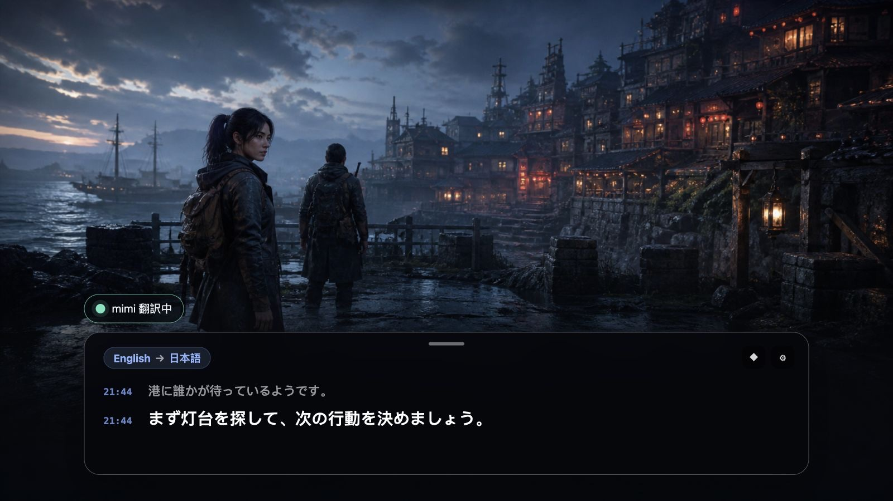

<div align="center">
  
  <h1>mimi</h1>
  <p>Mac / Windows で再生中の音声にリアルタイム翻訳字幕</p>
  <p>
    <a href="https://github.com/yuxino/mimi/releases/latest"><strong>mimiをダウンロード</strong></a>
    · <a href="README_ZH.md">简体中文</a>
    · <a href="README.md">English</a>
  </p>
</div>

mimiは、日本語の「耳（みみ）」に由来する名前です。デバイスで再生中の中国語・日本語・英語・韓国語を原文字幕として表示したり、簡体字中国語・英語・日本語へリアルタイム翻訳したりできます。Tauri v2（Rust + React）製で、同じコードベースが macOS と Windows の両方に対応しています。

<table>
  <tr>
    <td width="33.33%"></td>
    <td width="33.33%"></td>
    <td width="33.33%"></td>
  </tr>
  <tr>
    <td align="center">映画・動画</td>
    <td align="center">ゲーム・ライブ配信</td>
    <td align="center">会議・オンライン授業</td>
  </tr>
</table>

ブラウザ、動画プレイヤー、オンライン会議、オンライン授業、デスクトップアプリで使えます。

## 機能

- **リアルタイム字幕** — ブラウザ・プレイヤー・ゲーム・会議・デスクトップアプリに対応。
- **リアルタイム翻訳** — 超高速 / 低遅延 / 高品質の3モード。
- **柔軟な字幕ウィンドウ** — 移動・リサイズ・折りたたみ・クリック透過ロック。
- **多言語** — 中国語・日本語・英語・韓国語の認識。
- **プライバシー** — マイク不使用、アカウント不要、音声や字幕履歴の保存なし。
- **グローバルショートカット** — macOS は **⌘ ⇧ Space**、Windows は **Ctrl+Shift+Space** で開始/停止。

## はじめ方

1. [Releases](https://github.com/yuxino/mimi/releases/latest) からお使いのプラットフォーム版をダウンロードします。
2. アリババクラウド Model Studio（DashScope）の API キーを設定します。
3. 動画などを再生し、「開始」をクリックします。

API キーは OS のキーチェーン（macOS キーチェーン / Windows 資格情報マネージャー）に保存されます。mimi は DashScope の統合エンドポイントを利用するため、API キーのみで動作し、Workspace ID は不要です。モデル利用には料金がかかる場合があります。

[API キーの作成](https://help.aliyun.com/zh/model-studio/get-api-key)

### プラットフォームについて

- **macOS**：初回のリスニング時に「画面収録」の許可が求められます（システム音声の取得のみに使用し、画面は記録しません。mimi 自身の音声も除外されます）。
- **Windows**：WASAPI ループバックで既定の再生デバイスのミックス全体を取得します。許可は不要です。mimi は音を再生しないためエコーもありません。

## ソースからビルド

Rust 1.85+ と Node.js 20+ が必要です（macOS は Xcode Command Line Tools も必要）。

```bash
git clone https://github.com/yuxino/mimi.git
cd mimi
npm install
npm run tauri dev        # 開発実行
./scripts/check.sh       # 全チェック（fmt/clippy/テスト/フロントエンドビルド）
./scripts/package-app.sh # パッケージ化（macOS: .dmg / Windows: .msi/.nsis）
```

Windows 向けパッケージは Windows マシンでビルドしてください（Rust の C 依存は macOS から MSVC ターゲットへクロスコンパイルできません）。CI は macOS と Windows の両方で Rust テスト一式を実行します。

### macOS の開発メモ

- `npm run tauri dev` は裸のバイナリとして実行されるため `.app` バンドルがなく、macOS はバンドルからしかアイコンを読み込まないので Dock に汎用アイコンが表示されます。正しいアイコンで実行するには `./scripts/dev-app.sh` を使ってください。これは `tauri build` と同じ方法（`--features tauri/custom-protocol` 付き。この機能がないと Tauri はビルドを dev 扱いし、実行時に Dock アイコンをマスクなしの四角形へ置き換えます）で release バイナリをビルドし、本物の `.app`（オリジナルアイコン、ウィンドウタイトル/ツールチップに「(dev)」マーク付き）に包んで起動します。Dock アイコンは正式版と完全に一致します。
- ローカルビルドは `mimi Local Development` の安定した署名アイデンティティが存在する場合にそれで署名されます（`scripts/codesign-identity.sh`）。これにより画面収録とキーチェーンの許可が再ビルド後も維持されます（アプリのアイデンティティごとに一度だけ許可が必要です）。

## テスト

```bash
cd src-tauri && cargo test   # Rust ユニットテスト（プロトコル、字幕組み立て、設定、PCM など）
npm run test                 # フロントエンド vitest
```

UI スモークテストは `MIMI_UI_TEST=1`（デモ認証情報）と `MIMI_AUTO_START=1`（起動時に自動セッション開始、エラー経路の確認用）を付けて `npm run tauri dev` を実行します。

詳細は [CONTRIBUTING.md](CONTRIBUTING.md) と [SECURITY.md](SECURITY.md) をご覧ください。

[MIT](LICENSE) © 2026 yuxino
