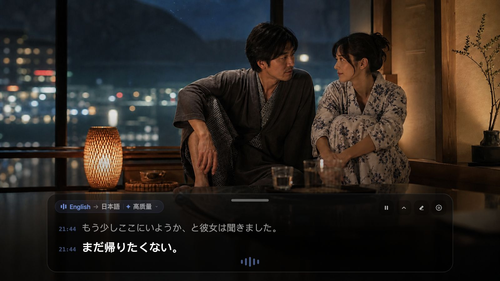

<div align="center">
  
  <h1>mimi</h1>
  <p>Macのリアルタイム翻訳字幕</p>
  <p>
    <a href="https://github.com/yuxino/mimi/releases/latest"><strong>mimiをダウンロード</strong></a>
    · <a href="README.md">简体中文</a>
    · <a href="README_EN.md">English</a>
  </p>
</div>

mimiは、日本語の「耳（みみ）」という読みをローマ字にした名前です。

Macで再生中の音声を聞き取り、中国語・日本語・英語・韓国語をそのまま原文字幕として表示したり、簡体字中国語・英語・日本語へリアルタイム翻訳したりできます。ブラウザ、動画プレイヤー、オンライン会議、デスクトップアプリで使えます。

字幕ウィンドウは移動でき、上下左右どの辺からでも自由にサイズを変えられます。固定すれば、字幕の上からそのまま動画を操作できます。現在の台詞ははっきりと、少し前の台詞は時刻とともに静かに薄く表示されます。話し続ける場面では、長い文章を読みやすい字幕単位に分け、末尾だけを更新します。

<table>
  <tr>
    <td width="50%"></td>
    <td width="50%"></td>
  </tr>
  <tr>
    <td align="center">字幕のない海外映画を楽しむ</td>
    <td align="center">台詞の多いストーリーゲームを楽しむ</td>
  </tr>
  <tr>
    <td width="50%"></td>
    <td width="50%"></td>
  </tr>
  <tr>
    <td align="center">大人向け・深夜の物語を追いかける</td>
    <td align="center">ライブ、ポッドキャスト、旅動画を理解する</td>
  </tr>
</table>

### 会議中にも使えます

<div align="center">
  
</div>

mimiは動画を見るときだけのものではありません。

Zoom、Meet、Teams、Feishu、Webinar、オンライン授業などで、相手の声がMacから再生されていれば、そのまま字幕にできます。海外面接、多言語ミーティング、聞き取りにくいアクセントの会話にも便利です。

mimiが取得するのはシステム音声で、マイクではありません。自分の声を録音せず、字幕ウィンドウから一時停止 / 再開、コンパクト表示への折りたたみ、左上からの認識言語切り替えができます。短い通信エラーなら、表示済みの字幕を残したまま自動で再接続を試みます。

## はじめる

1. [Releases](https://github.com/yuxino/mimi/releases/latest)から最新版をダウンロード
2. Alibaba Cloud Model StudioのWorkspace IDとAPI Keyを入力
3. 動画を再生するか会議に入り、**Start Listening**をクリック

現在のUIでは、中国語原文・英語・日本語・韓国語から認識言語を手動で選べます。字幕は原文のまま表示するか、簡体字中国語・英語・日本語へ翻訳できます。翻訳を使う場合、現在のビルドでは高品質モードを使用します。

> mimiは、まだAppleの公証を受けていません。初回起動時にmacOSでブロックされた場合は、「システム設定 → プライバシーとセキュリティ」から「このまま開く」を選んでください。

## 字幕だけ。余計なことはしません。

mimiはマイクを使いません。アカウント登録も不要で、音声や字幕の履歴を保存することもありません。API KeyはmacOSのキーチェーンに保管されます。

確定した字幕はウィンドウ内に残り、少し前の台詞は静かに薄くなり、現在の一文ははっきり表示されます。長く話し続ける場面では、句読点や長さに合わせて読みやすい単位に分割し、段落全体が何度も動かないようにしています。

[API Keyを作成](https://help.aliyun.com/en/model-studio/get-api-key) · [Workspace IDを確認](https://help.aliyun.com/en/model-studio/obtain-the-app-id-and-workspace-id)

> Workspace IDとAPI Keyは、同じ中国（北京）リージョンのワークスペースで発行されたものを使用してください。モデルの利用には料金がかかる場合があります。

## ちょっと便利な使い方

- `⌘ ⇧ Space` ですぐにリアルタイム字幕を開始 / 停止できます
- 上部中央の短いハンドルをドラッグして移動。四辺と四隅から自由にサイズ変更できます
- 上部をダブルクリックすると小さなステータスバーに折りたためます。もう一度ダブルクリックするか展開ボタンで元に戻せます
- 右上から一時停止 / 再開でき、すでに表示されている字幕は消えません
- 左上の言語表示をクリックすると、設定画面を開かずに認識言語を切り替えられます
- 左上の状態表示と下部の波形で、待機・認識・翻訳・一時停止の状態が分かります
- 薄い時刻は確定済みの字幕を示し、現在の台詞は明るく表示されます
- 固定すると、字幕の上からそのまま動画や会議画面を操作できます
- 右上の消しゴムで、表示中の字幕を消去できます
- 短い通信エラーでは自動復旧を試み、表示済み字幕を意図的に消去しません
- 字幕が二重に表示されたら、Chromeの「自動字幕起こし / リアルタイム翻訳」をオフにしてください

<details>
<summary>ソースからビルド</summary>

macOS 14以降と、Xcode 16またはSwift 6を含むXcode Command Line Toolsが必要です。

```bash
git clone https://github.com/yuxino/mimi.git
cd mimi
swift run mimi-core-tests
swift build -c release -Xswiftc -warnings-as-errors
./scripts/package-app.sh
open dist/mimi.app
```

</details>

## mimiに参加する

[Issue](https://github.com/yuxino/mimi/issues)やPull Requestを歓迎します。開発を始める前に[CONTRIBUTING.md](CONTRIBUTING.md)を読み、セキュリティ上の問題は[SECURITY.md](SECURITY.md)に従って非公開で報告してください。

[MIT](LICENSE) © 2026 yuxino
